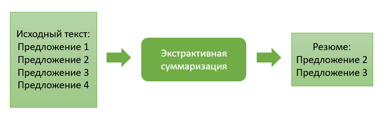
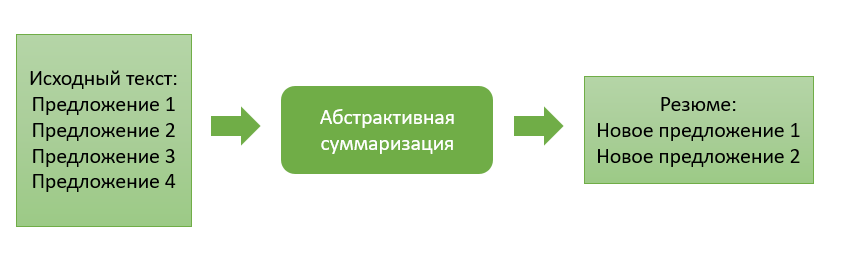
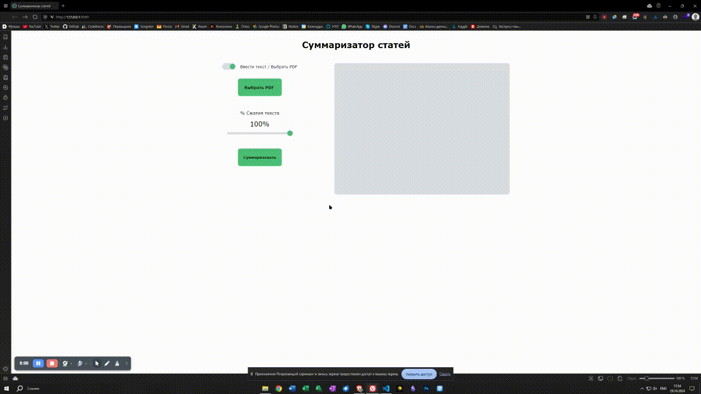

# Ассистент для работы с научной литературой

## **Постановка проблемы и предлагаемое решение**

### Проблема

Постоянно растущий объем информации не позволяет ученым эффективно управлять ей и освободиться от рутинных процессов в своей работе.

### Анализ области

Работа с научной литературой требует от ученых способности эффективно обрабатывать большие объемы данных. Важно уметь правильно искать статьи. Полезный совет — обращать внимание на самые свежие и цитируемые работы.

Одна из основных проблем в сфере научных публикаций — это ограниченный доступ. Результаты исследований часто оказываются платными. Также существует проблема большого количества стандартов и требований разных журналов, что затрудняет процесс отбора работ.

### Что делать?

Для решения проблемы доступа к большому объему информации среди научных сотрудников необходимо создать модель ИИ, способную делать выжимку и отвечать на вопросы, поставленные пользователем.

### Аналоги

| Google Scholar                                                                                                                                                                                                               | Semantic Scholar                                                                                                                                                                                                                                                                                                                          | Scite.AI                                                                                                                                                                                                                 |
|------------------------------------------------------------------------------------------------------------------------------------------------------------------------------------------------------------------------------|-------------------------------------------------------------------------------------------------------------------------------------------------------------------------------------------------------------------------------------------------------------------------------------------------------------------------------------------|--------------------------------------------------------------------------------------------------------------------------------------------------------------------------------------------------------------------------|
| Поисковая система по научным публикациям. Пользователи могут искать нужные работы по авторам, ключевым словам, названию журнала. Углублённый поиск позволяет ранжировать материалы по публикации, дате и предметной области. | Поисковая платформа, поиск научных публикаций в которой производится с помощью искусственного интеллекта. Поисковый сервис комбинирует машинное обучение, обработку естественного языка и машинного зрения. Semantic Scholar выделяет наиболее важные статьи, а также связи между ними. | Платформа для исследований на базе искусственного интеллекта, которая анализирует научные публикации, предоставляет контекст для цитирований и помогает исследователям оценивать достоверность и влияние научных статей. |

### Суммаризация

В решении задачи суммаризации текста используются как экстрактивные, так и абстрактивные подходы.

Экстрактивные методы извлекают ключевые предложения из текста, используя алгоритмы ранжирования, тогда как абстрактивные генерируют новые предложения, обобщающие исходные данные.




### Наше решение

Для задачи суммаризации текста мы провели анализ моделей и сделали выбор в пользу архитектуры **BART**. По всем параметрам она является лучшей для нашей задачи.

| Модель  | Метод суммаризации | Многоязычность | Метод работы                         |
|:-------:|:------------------:|:--------------:|:------------------------------------:|
| BART    | Абстрактивный      | Да             | Генерация текста                     |
| T5      | Абстрактивный      | Да             | Предсказывание пропущенного значения |
| Pegasus | Абстрактивный      | Нет            | Предсказывание пропущенного значения |

Ассистент будет представлять из себя сайт, на котором пользователь сможет ввести свой запрос и получить ответ на него.

Уникальность нашего решения заключается в возможности приложить свою статью для создания выжимки из нее, а также в классификации вопросов на логически связные и вопросы, на которые нейросеть не сможет дать ответ. Это расширит возможности модели и поможет оптимизировать ресурсы, не отвечая на странные и глупые вопросы.

#### 1 Этап

На данном этапе мы займемся сбором и анализом данных для дальнейшего обучения модели.

Также возможно создание собственного датасета под задачу классификации релевантности вопроса.

##### Высокоуровневый план

Реализацию нашего проекта мы разделили на 3 этапа:

1. Сбор данных
2. Создание модели
3. Создание сайта

#### 2 Этап

Этот этап представляет из себя создание и оценку качества модели. Также возможно расширение функционала, благодаря созданию дополнительной модели для оценки качества заданного вопроса.

Основной моделью для суммаризации текста и генерации ответа на вопрос мы выбрали BART.

Для разработки модели был выбран PyTorch из-за его большой популярности на сегодняшний день.

#### 3 Этап

Здесь мы займемся созданием прототипа сайта для более комфортного доступа к модели.
В качестве языка бэкенда будет взят Python в связи с простотой интеграции модели и фреймворк Flask.

Фронтенд будет сделан на основных веб технологиях.

## **Создание проекта**

### 1. Анализ данных и выбор метрик

#### Анализ данных

Проведя анализ данных из датасета PubMed мы выяснили несколько фактов:

1. Практически все статьи из датасета написаны на английском языке, за исключением 1 на французском и 1 на итальянском языке. Исходя из этого мы приняли решения исключить эти 2 статьи из датасета, как выбросы

2. Общая тематика статей связана с медицинскими исследованиями, биологией и химией

3. В статьях присутствует большое количество чисел, сокращений и вставных конструкций. Это значит, что наша модель должна уметь отличать подобные токены от ненужных по типу союзов, предлогов и т.п.

4. В датасете присутствовали записи, где на пустую строку был предоставлен четкий ответ. Такие строки так же были удалены из выборки

#### Выбор метрик

Изучив различные метрики оценки качества резюмирования мы пришли к выводу, что метрика ROUGE является самой подходящей под нашу задачу.

Вы можете более подробно ознакомиться с результатами нашей работы в [файле](data_analyze.ipynb).

### 2. Обучение и тестирование моделей

Для обучения и тестирования моделей не был использован весь датасет (117 тыс. записей) из-за ограниченности ресурсов, а лишь ≈ 17%.

После обучения BART показал сходство слов в суммаризированном тексте в 32.3%.
В качестве 2 архитектуры для проведения сравнения был выбран T5. Ее результат не превысил 28%, а модель работала в разы медленнее предыдущей.

Также для сравнения мы взяли уже обученную модель от Facebook [bart-large-cnn](https://huggingface.co/facebook/bart-large-cnn). Совпадение слов составило 35.3%, однако показатель rougeLsum оказался хуже, чем у нашей модели BART.

Так, мы подтвердили нашу гипотезу о том, что BART справляется лучше с задачей суммаризации и приняли решение использовать ее как основную. Но несмотря на чуть лучшие показатели модели от Facebook мы отдали предпочтение нашей разработке, т.к. она была дообучена на данных нужной тематики.

С результатами работы вы так же можете ознакомится в [BART](bart.ipynb) и [T5](t5.ipynb).

### 3. Создание прототипа web-сервиса


Пример работы

#### Frontend

Для создания были использованы стандартные технологии: HTML, CSS, JS. Чтобы получить резюме текста пользователь может прикрепить PDF файл или вставить текст в поле ввода. Для этого был создан переключатель режима. Также реализована возможность выбрать процент сжатия текста, который нужен пользователю. Цвета для дизайна нашего сайта были взяты с официального [сайта BIOCAD](https://biocad.ru).

#### Backend

В разработке мы использовали Python и веб-фреймворк Flask. Парсинг PDF файлов производится с помощью библиотеки fitz. Более подробно ознакомиться с нашим решением вы можете в [файле](main.py).

### Инструкция для запуска

1. Скачайте [архив](https://disk.yandex.ru/d/uVUaPPn_q12Y_Q) со всеми нужными файлами, откройте и перейдите в консоль
2. Выполните команду
```bash
pip install -r requirements.txt
```
3. Запустите проект с помощью команды
```bash
python main.py
```
